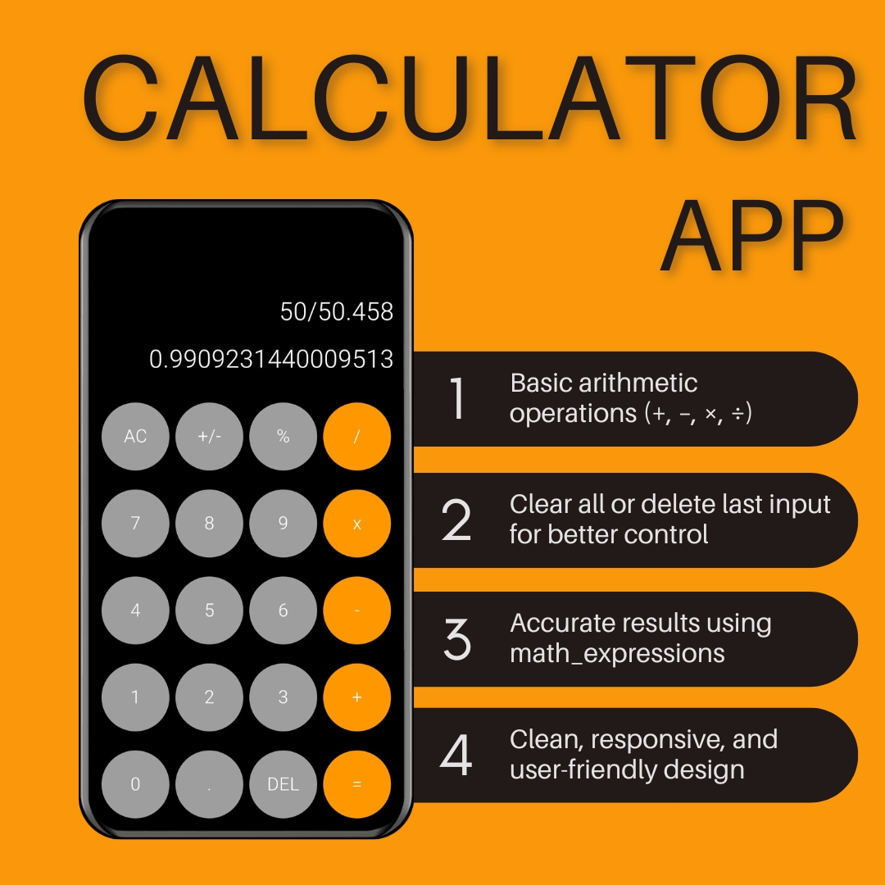

# 🧮 Flutter Calculator App – Elegant Arithmetic UI (Flutter + math_expressions)



The **Flutter Calculator App** is a sleek, minimalistic calculator built using **Flutter** and the `math_expressions` package. Designed for responsiveness and accuracy, it supports core arithmetic operations with a clean, intuitive user interface.

---

## 📱 Application Features

- ➕ Basic operations: **Addition, Subtraction, Multiplication, Division**
- 🧹 **AC (All Clear)** and **DEL (Delete)** buttons for easy expression handling
- 🧠 Expression evaluation using **math_expressions**
- 📱 Responsive design for various screen sizes and orientations
- 🧩 Custom button widgets for consistency and clarity

---

## 🔍 Project Description

The **Flutter Calculator App** aims to provide users with a smooth, responsive, and functional experience for solving basic mathematical expressions. Ideal for Flutter beginners or those looking to understand widget layouts and state management fundamentals.

- Minimal UI with elegant interaction
- Accurate result parsing and evaluation
- Easily extendable for scientific functions or advanced math

---

## ✅ Functional Requirements

### 🔢 Calculator Engine
- Input numbers and operations
- Evaluate full expressions using `Parser` from `math_expressions`

### 🧼 UI Controls
- All Clear resets the input and result
- Delete removes the last character
- Real-time display of input and output

### 🎨 Interface
- Button grid UI with responsive layout
- Custom button components for flexibility

---

## 🧰 Tech Stack

- **Framework:** Flutter (Dart)
- **Math Engine:** `math_expressions` package
- **UI Toolkit:** Custom Widgets + Material Components
- **State Management:** `setState()` based for simplicity

---

## 🚀 Getting Started

### 🔧 Installation

1. Clone the repository:
   ```bash
   git clone https://github.com/MH-MuhammadHassan/Flutter-Calculator-App.git
   cd Flutter-Calculator-App
